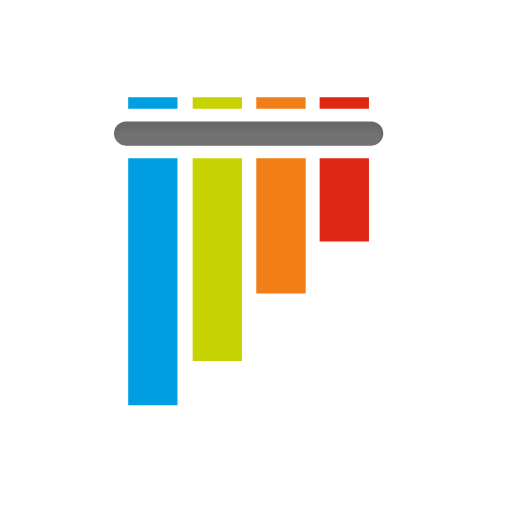
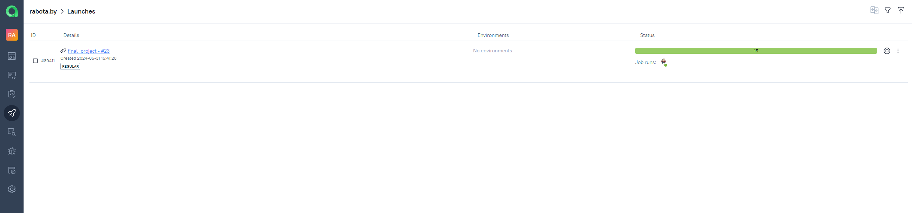

<h1>Tests for automated testing of the <i>rabota.by</i> website</h1>

---

    

<h2> Description</h2>
<li><a href="#tools">Tools</a></li>
<li><a href="#tests">Tests</a></li>
<li><a href="#run-tests">Run tests</a></li>
<li><a href="#test-example">Example of passing test</a></li>
<li><a href="#telegram-notification">Telegram notifications</a></li>

---

<h2 id="tools"> Tools</h2>

    
    
    
    
    
    
    
    
    
    
    
    

Autotests are written in <b>Python</b> using <b>Selenide</b> for <i>UI tests</i>, <b>Browserstack</b>, <b>emulator or real device</b> for <i>mobile tests</i>

Tests are run from <b>Jenkins</b>

<b>Selenoid and Browserstack</b> are used to launch the browser

<b>Allure report</b> is generated and sent to telegram

---

<h2 id="tests"> Tests</h2>

<b>UI tests:</b>

 Successfully login

 Unsuccessfully login

 Search company

 Advanced search

 Open resume page

 Save search without registering

 Choose city

<b>API tests:</b>

 Login with correct data

 Login with incorrect data

 Search vacancy

 Add vacancy to favorite without registered

 Enter phone number for get otp

<b>Mobile tests:</b>

 Login page

 New user page

 User profile

---

<h2 id="run-tests"> Run tests</h2>

<b>For web tests:</b>

<pre>
    pytest tests/web
</pre>

<b>For API tests:</b>

<pre>
    pytest tests/api
</pre>

<b>For mobile tests on emulator:</b>

<pre>
    pytest tests/api --context=local_emulator
</pre>

<b>For mobile tests on real device:</b>

<pre>
    pytest tests/api --context=real_local
</pre>

<b>For mobile tests on bstack:</b>

<pre>
    pytest tests/api --context=bstack
</pre>

---

To run tests in Jenkins you need to click on <b>Build with Parameters</b> button

Сhoose parameters (<i>BROWSER_VERSION, ENVIRONMENT, COMMENT</i>) and click on <b>"Build"</b> button

After passing the tests report will be generated, you can see it by clicking on the <b>Allure report</b> and <b>Allure TestOps</b>

<a href="https://allure.autotests.cloud/launch/39345">TestOps</a>

---

<h2 id="test-example">Example of passing search of company test</h2>

---

<h2 id="telegram-notification">Telegram notifications</h2>

